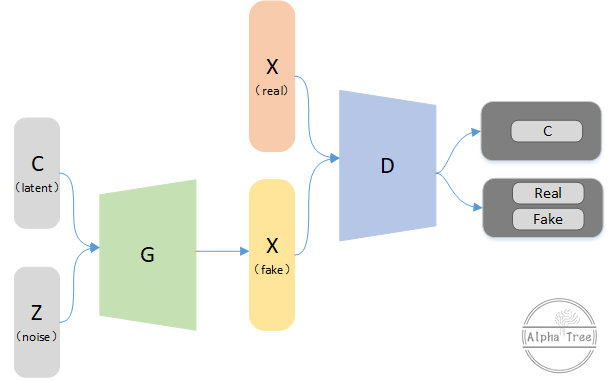

# InfoGAN

InfoGAN is an information-theoretic extension of the Generative Adversarial Network that is able to learn disentangled representations in a completely unsupervised manner.

## Architecture Diagram

## Reference
- **Paper:** [InfoGAN: Interpretable Representation Learning by Information Maximizing Generative Adversarial Nets](https://arxiv.org/abs/1606.03657)
- **Year:** 2016
