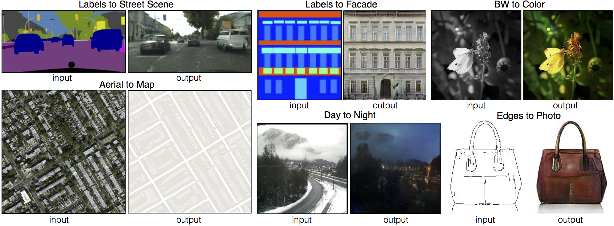

# Pix2Pix

Pix2Pix is a conditional GAN framework designed for paired image-to-image translation tasks, such as turning sketches into photos or day scenes into night scenes.

## Architecture Diagram

## Reference
- **Paper:** [Image-to-Image Translation with Conditional Adversarial Networks](https://arxiv.org/abs/1611.07004)
- **Year:** 2016
