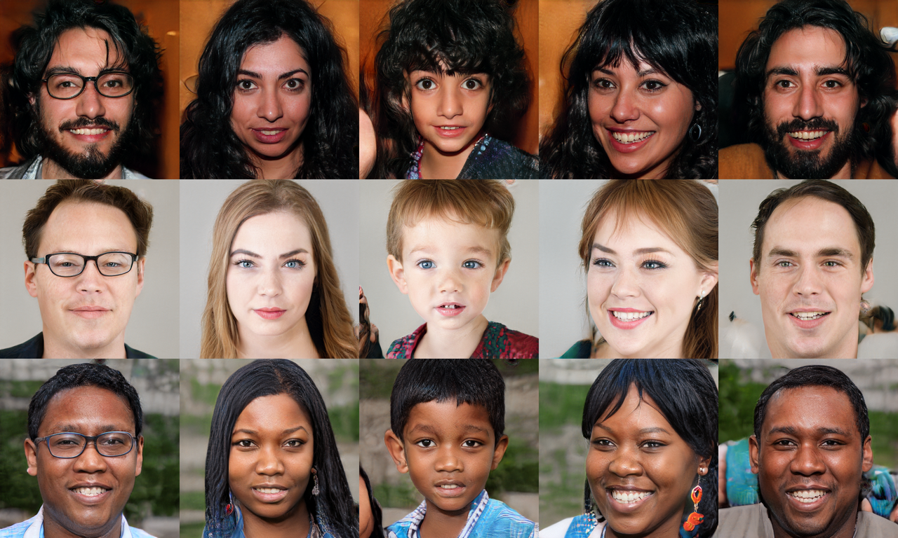

# StyleGAN

StyleGAN introduces a style-based generator architecture that allows for intuitive, scale-specific control of the synthesis process, producing extremely high-quality and realistic images.

## Architecture Diagram

## Reference
- **Paper:** [A Style-Based Generator Architecture for Generative Adversarial Networks](https://arxiv.org/abs/1812.04948)
- **Year:** 2018
