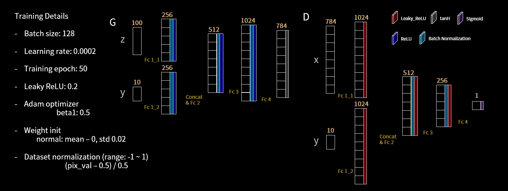

# Conditional GAN (cGAN)

Conditional GANs allow for the generation of specific types of data by conditioning the model on additional information, such as class labels or data from other modalities.

## Architecture Diagram

## Reference
- **Paper:** [Conditional Generative Adversarial Nets](https://arxiv.org/abs/1411.1784)
- **Year:** 2014
